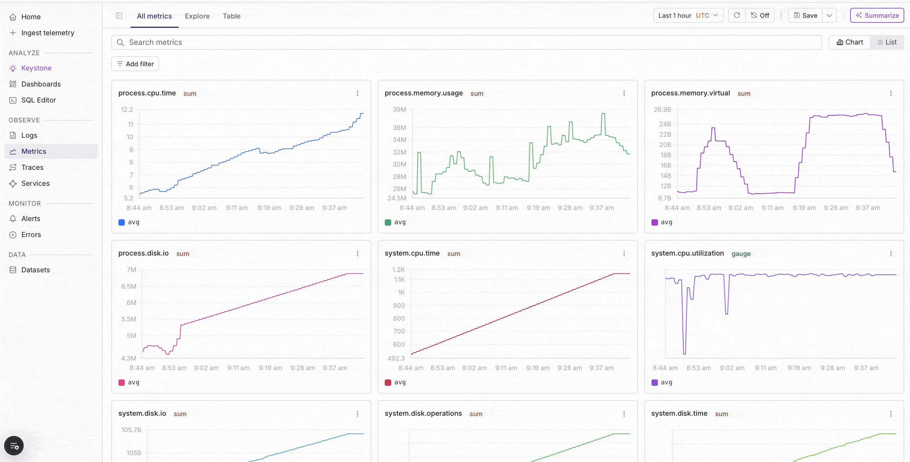
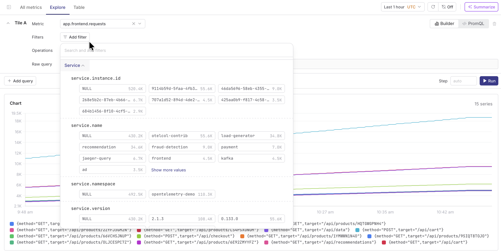
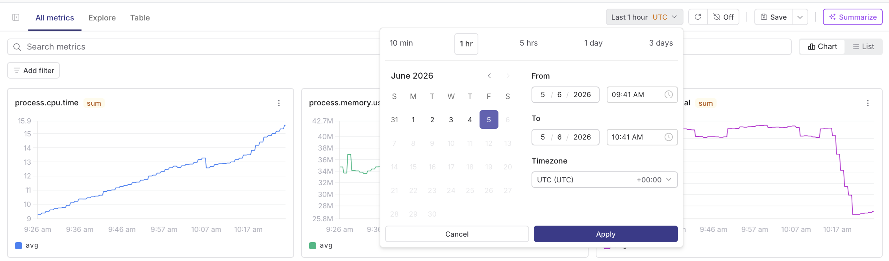

The **Metrics explorer** is the main interface where you browse, analyze, and take action on your metric data. It provides a clean, visual grid overview of all metrics in a dataset, along with powerful tools to filter data, change time windows, get automated summaries, and more.

## Selecting a dataset
At the very top-left of the page, there is a dropdown menu that displays your active metrics dataset namespace. 

Clicking this dropdown allows you to search for and swap between different cluster namespaces. Changing this option immediately updates the entire page to reflect the telemetry of the new dataset.

## Interface Layout & Zones

### Top control bar
This section serves as the primary navigation and configuration shelf, spanning the entire top portion of the interface.

* **Navigation tabs:** Located on the left side of this panel, these tabs allow you to switch between three core operational views: *All Metrics*, *Explore*, and *Table*.
* **Global action cluster:** Positioned at the far right, this area groups together essential operational controls. This includes selecting the active time range (e.g., Last 10min/1hour/3days), managing the auto-refresh toggle, saving your current view configuration, and triggering the automated Summarize action.

### Search and filtering zone

Positioned immediately below the top control bar, this area is dedicated to managing query scoping and data presentation.

* **Search and filter inputs:** On the left, the main search input and `+ Add filter` button enable you to narrow down data fields by specific label-value attributes.
* **Layout scaling toggles:** Towards the far right edge, these two buttons control how information fills the screen, offering a *Chart view* for side-by-side graphical trends and a *List view* for vertical parameters.

### Metric grid

This central workspace serves as the responsive area where telemetry is actively visualized. It functions as a dynamic grid displaying multiple individual metric cards such as CPU time, memory usage, disk I/O, and others, where each card acts as an independent, interactive reporting panel.

---

## Navigation and discovery

### Tabs

Three tabs sit at the top center of the page to let you view your data differently depending on your troubleshooting goals:

* **All Metrics Tab:** This is your default dashboard view. It maps every metric registered under your chosen dataset into its own visual chart card. This layout makes it easy to monitor items like CPU, memory, and disk utilization simultaneously.
* **Explore tab:** This tab opens up an ad-hoc query workspace. It is designed for isolating specific metrics, running, and comparing performance curves against static baselines.
* **Table tab:** This tab completely switches your view from graphical trend charts to a raw data log spreadsheet. It displays incoming data points in horizontal rows showing exact timestamps, ingestion values, and structured metadata attributes.

---

## Working with metric cards

Each individual card in the main grid acts as a standalone monitoring panel for a specific metric key. The card includes a few important indicators: 

* **Metric key name:** Located at the top-left corner of the card (for example, `process.cpu.time`, `process.memory.usage`, or `process.disk.io`).
* **Card context menu:** This three-dot icon sits at the top-right corner of each card, providing a shortcut to launch a detailed breakdown for that specific metric exploration.

> 💡 **Tip:** Selecting a metric card directly will trigger a comprehensive breakdown view, which also includes quick-access options to analyze additional related telemetry signals.

---

## Querying and filtering

### Filtering your view

You can narrow down the metrics on your screen by using the search bar or by clicking the `+ Add filter` button. This lets you type specific metric terms or pick particular label-value pairs to isolate a single system component across the entire visual dashboard.

### Built-in PromQL engine

Additionally, the [Parseable enterprise](https://www.parseable.com/docs/user-guide/promql) includes a built-in PromQL engine that lets you query metrics stored in Parseable using the standard Prometheus Query Language. 

* **No separate instance needed:** You can ingest, store, and query metrics all within Parseable.
* **Standard conventions:** All endpoints live under the `/prometheus/api/v1` base path and follow the Prometheus HTTP API conventions.
* **Compatibility:** Existing grafana dashboards and Prometheus-compatible tooling work without changes pointing to the datasource at your Parseable instance.

---

## Toolbar & control setting

### Time range settings

Clicking the active time box on the top-right toolbar opens up an absolute scheduling menu overlay which handles three tasks:

1. **Quick presets:** Fast clickable choices to quickly snap your query to common rolling windows like 10 min, 1 hr, or 3 days.
2. **Calendar range Picker:** Separate interactive *From* and *To* input fields paired with a calendar view to pinpoint exact dates and times.
3. **Timezone dropdown:** A setting to align your chart graphs with your local workstation time or a global standard coordinate system (UTC).

### Auto-refresh and controls

You can control how often your metrics reload using the buttons on the top-right toolbars:

* **Manual refresh:** Forces an immediate query refresh to update all grid cards on your screen.
* **Auto-refresh dropdown:** A menu displaying reload frequencies like `10s`, `30s`, `1m`, or `Off` to keep data fresh automatically.

### Action toolbar features

* **Save view:** Saves your active configuration settings, filters, and zoom levels into a persistent workspace profile.
* **Summarize button:** A sparkle icon that prints a plain text summary explaining telemetry anomalies and potential root causes.
