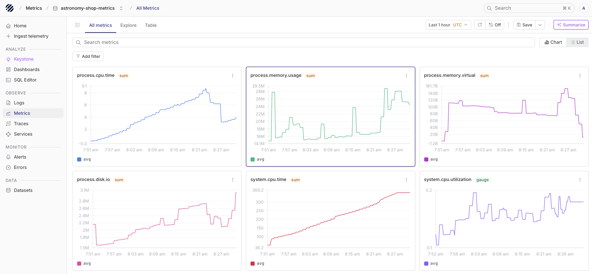
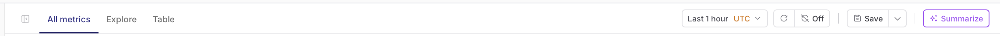
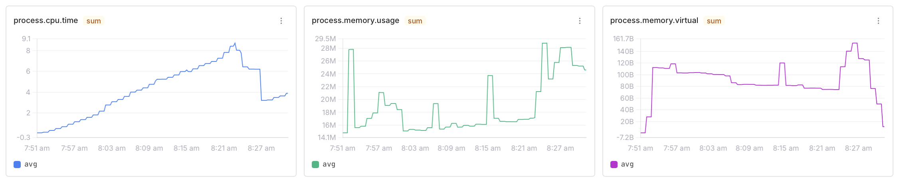
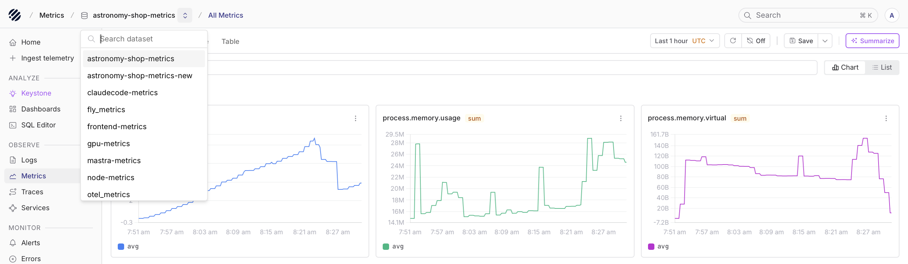
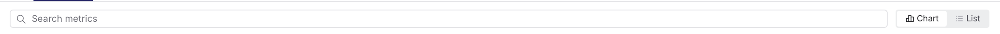
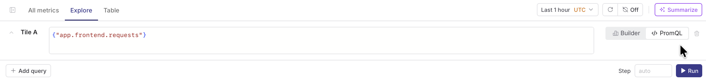

The Metrics explorer is the main interface where you browse, analyze, and take action on your metric data. It provides a clean, visual grid overview of all metrics in a dataset, along with powerful tools to filter data, change time windows, get automated summaries, and more.

## Page layout

The Metrics Explorer page is organized into three tabs. 

The "All Metrics" tab is the default view, which displays all metrics in the selected dataset as a grid of individual metric cards. This layout makes it easy to monitor items like CPU, memory, and disk utilization right away as you land here. This tab has a toggle on the right side with options to view the metrics as "Chart" or "List". List view shows the same metrics in a tabular form, allowing drill down into a specific metric and its associated labels.

The "Explore" tab is the second tab. It is an ad-hoc query workspace for isolating specific metrics and comparing performance curves. It is designed for isolating specific metrics, running, and comparing performance curves against static baselines.

The "Table" tab switches to a raw data metrics spreadsheet view. It displays incoming data points in horizontal rows showing exact timestamps, ingestion values, and structured metadata attributes.

Additionally, the page has a top control bar with search and filtering inputs, layout scaling toggles, and a time range picker.

## Typical workflow

### Start by selecting a dataset

Datasets are the [primary data organization unit](https://www.parseable.com/docs/key-concepts/data-model) in Parseable. Select the dataset you want to explore from the dropdown menu at the very top-left of the page. Changing this option immediately updates the entire page to reflect the telemetry of the new dataset.

### Search and filter

Below the tab selection area, the main search input and `Add filter` button enable you to narrow down data fields by specific label-value attributes. For example, you could filter to a specific `host` or `region` to isolate a single system component across the entire visual dashboard. The search input supports free text search across all label values, while the `Add filter` button provides a structured interface for building complex queries with multiple label conditions.

### Working with metric cards

Each individual card in the main grid acts as a standalone monitoring panel for a specific metric key. The card includes a few important indicators: 

* **Metric key name:** Located at the top-left corner of the card (for example, `process.cpu.time`, `process.memory.usage`, or `process.disk.io`).
* **Card context menu:** This three-dot icon sits at the top-right corner of each card, providing a shortcut to launch a detailed breakdown for that specific metric exploration.

> 💡 **Tip:** Selecting a metric card directly will trigger a comprehensive breakdown view, which also includes quick-access options to analyze additional related telemetry signals.

### Exporting data with PromQL

<OfferingPills pro enterprise className="mb-4" />

Additionally, the [Parseable enterprise](https://www.parseable.com/docs/user-guide/promql) includes a built-in PromQL engine that lets you query metrics stored in Parseable using the standard Prometheus Query Language. 

* **No separate instance needed:** You can ingest, store, and query metrics all within Parseable.
* **Standard conventions:** All endpoints live under the `/prometheus/api/v1` base path and follow the Prometheus HTTP API conventions.
* **Compatibility:** Existing grafana dashboards and Prometheus-compatible tooling work without changes pointing to the datasource at your Parseable instance.

### Action toolbar features

* **Save view:** Saves your active configuration settings, filters, and zoom levels into a persistent workspace profile.
* **Summarize button:** A sparkle icon that prints a plain text summary explaining telemetry anomalies and potential root causes.
