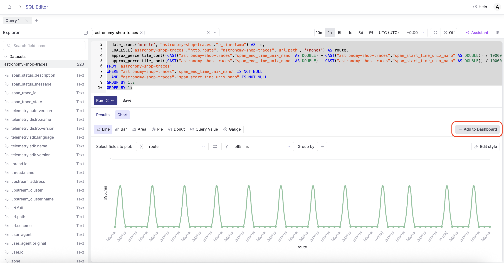
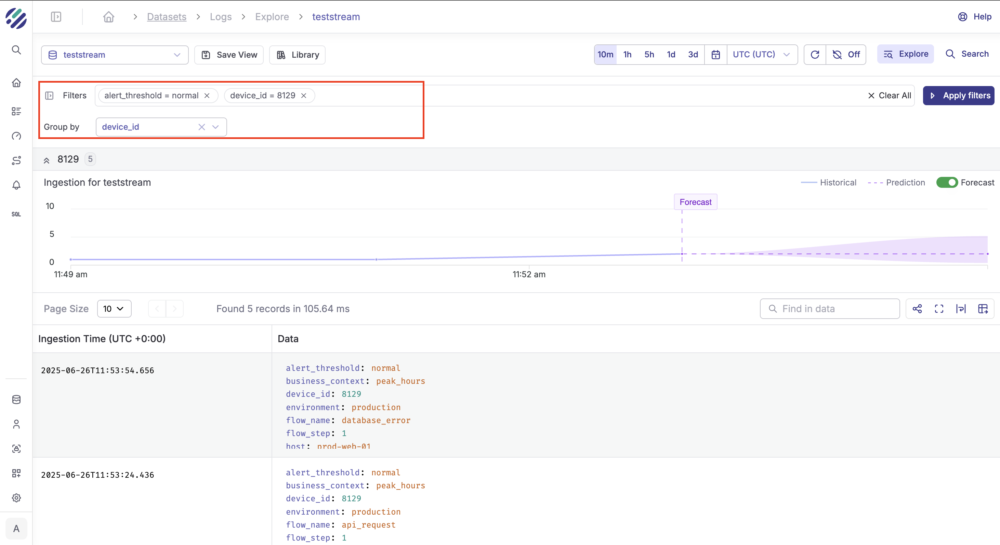
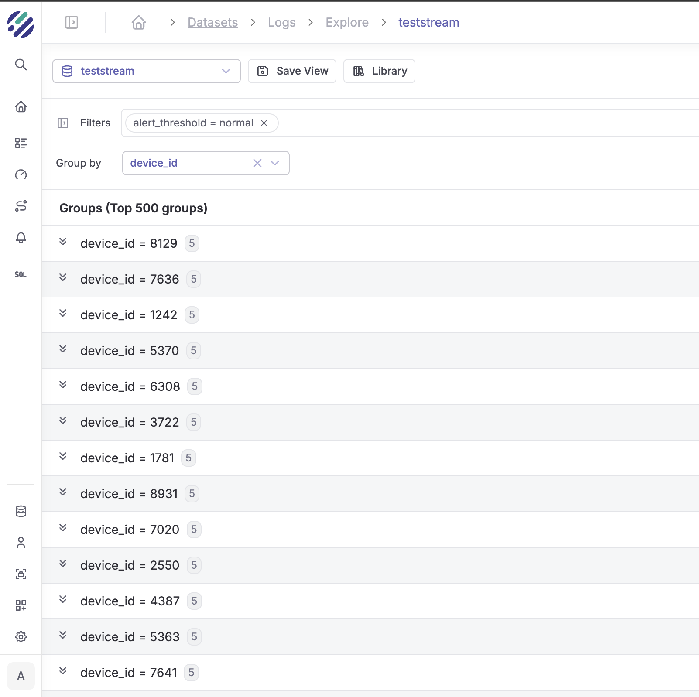

Parseable provides a powerful SQL editor that allows you to query your telemetry data (logs, metrics, and traces) using PostgreSQL compatible SQL syntax.


## Getting Started

1. Navigate to the SQL Editor in the Parseable UI
2. Select your dataset from the dropdown
3. Write your SQL query
4. Click "Run" to execute

## Features

- **Full SQL Support** - Use standard SQL queries to analyze your data
- **Auto-completion** - Intelligent suggestions as you type
- **Query History** - Access your previous queries
- **Export Results** - Download query results in various formats

## Example Queries

```sql
-- Get recent data
SELECT * FROM mystream LIMIT 100

-- Count by level
SELECT level, COUNT(*) as count 
FROM mystream 
GROUP BY level

-- Filter by time range
SELECT * FROM mystream 
WHERE p_timestamp > NOW() - INTERVAL '1 hour'
```

## Query with Regular Expressions

Examples of how to use regular expressions in Parseable queries:

### Match regular expression (Case Sensitive)

```sql
SELECT * FROM frontend where message ~ 'failing' LIMIT 9000;
```

### Match regular expression (Case Insensitive)

```sql
SELECT * FROM frontend where message ~* 'application' LIMIT 9000;
```

### Does not match regular expression

```sql
SELECT * FROM frontend where message !~ 'started' LIMIT 9000;
```

### Matches the beginning/end of the string

```sql
SELECT * FROM frontend where message ~* '^a' LIMIT 9000;
SELECT * FROM frontend where message ~ 'failing$' LIMIT 9000;
```

### Replace with REGEXP_REPLACE

```sql
SELECT REGEXP_REPLACE(uuid,'[0-9]','*','g') FROM frontend LIMIT 9000;
```

### Split a string with SPLIT_PART

```sql
SELECT SPLIT_PART(email,'@',1) FROM frontend where email is not null LIMIT 10;
```

### Pattern matching with LIKE

```sql
SELECT * FROM frontend where email LIKE '%test%' LIMIT 10;
```

## Case Sensitivity

Dataset column names are case sensitive. To query column names with uppercase letters, use double quotes:

```sql
SELECT * FROM stream WHERE "Foo" = 'bar'
```

## Query Analysis

To view the detailed query execution plan, use the `EXPLAIN ANALYZE` keyword:

```sql
EXPLAIN ANALYZE SELECT * FROM frontend LIMIT 100
```

## Response Fields Information

To get the query result fields as a part of query API response, add the query parameter `fields=true`:

```
http://localhost:8000/api/v1/query?fields=true
```

## Add Charts to Dashboard

After running a query, you can visualize the results and add them directly to a dashboard.



## Filters and Group By

Use the filter panel to slice and dice your data, and group results by any field.





## Query Library

Save queries you want to reuse in the Library for quick access.


## Tips

- Use `p_timestamp` for time-based filtering
- Use `LIMIT` to prevent large result sets
- Use `GROUP BY` for aggregations
- For AI-powered query generation, see [Text to SQL](/user-guide/ai-native/text-to-sql)
