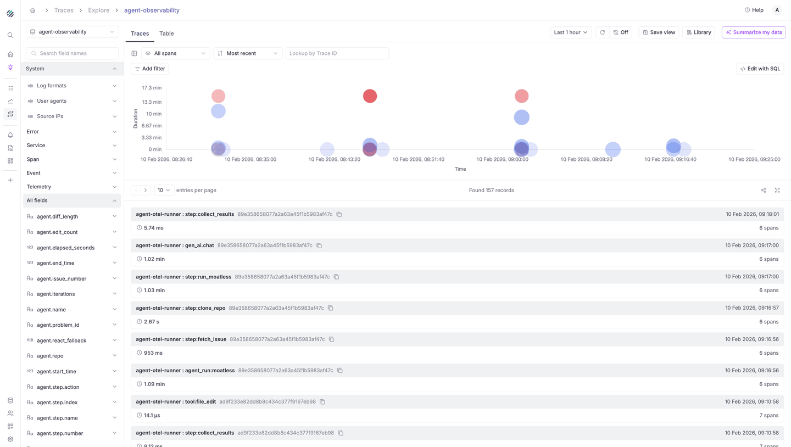
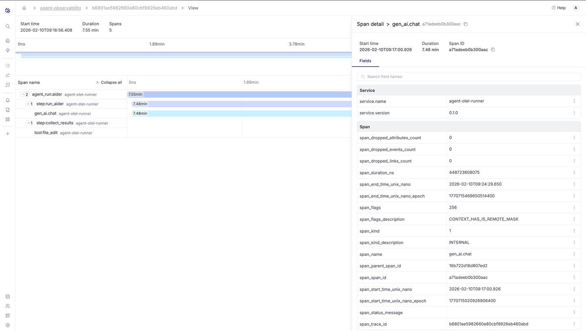

Traces Explore is the primary interface for searching, filtering, and analyzing distributed traces in Parseable. It provides a scatter-plot of trace durations over time, a paginated trace list, powerful filtering capabilities, and detailed span-level inspection with a waterfall view.

{/* TODO: Add screenshot of full Traces Explore page */}

## Page Layout

The Traces Explore page is composed of four main areas:

- **Top Toolbar** - Dataset selector, Traces/Table tabs, time range picker, refresh controls, saved views, and AI summarization
- **Left Sidebar (Field Browser)** - A categorized and searchable list of all trace attributes and span fields
- **Central Content Area** - A scatter-plot of trace durations and a paginated trace list (Traces view), or a line chart and raw span table (Table view)
- **Detail Panels** - Contextual panels that appear when you click on a trace or span

## Dataset Selector

A dropdown at the top-left shows the currently selected trace dataset (e.g., "k8s-traces"). Click it to open a searchable dropdown listing all available trace datasets. Selecting a different dataset reloads the page with that dataset's traces and field schema.

{/* TODO: Add screenshot of dataset selector */}

## Traces / Table Tabs

Two tabs toggle between the **Traces** view and the **Table** view:

- **Traces** - The default view, optimized for trace-level exploration with a scatter chart and trace list
- **Table** - Displays individual span records in a flat tabular format, useful for raw data inspection and bulk analysis

## Time Range Picker

Click the time range button (e.g., "Last 1 hour") to configure the query window:

- **Quick presets** - 10 min, 1 hr, 5 hrs, 1 day, 3 days
- **Custom range** - Calendar-based date/time selection with From and To fields
- **Timezone** - Timezone selector for the displayed times

Click **Apply** to update the query or **Cancel** to dismiss.

## Refresh and Auto-Refresh

- **Refresh** - The circular arrow icon immediately re-queries the data
- **Auto-refresh** - Labeled "Off" by default. Click to select an interval: 10s, 30s, 1m, 5m, 10m, or 20m

## Save View

Click **Save view** to persist the current query configuration (filters, time range, sort order) as a named view. The dialog includes a required Title, optional Description, and an **Include time range** toggle.

## View Library

Click **Library** to open a side panel with three tabs:

- **Recent** - Views you recently accessed
- **My views** - Views you created
- **All views** - All views across the team

A search bar lets you find saved views by name. Click a view to restore its configuration.

## Summarize My Data

Click **Summarize my data** to trigger an AI-powered summary of the trace data within the current time window. You can select the AI model (e.g., gpt-4.1-mini) from a dropdown. The summary runs in the background through several stages: running the query, filtering irrelevant entries, and clustering similar patterns.

The resulting Summary Report includes:

- A narrative summary of the trace data
- Error/warning metric cards
- Detailed observations about patterns and anomalies
- Actionable recommendations
- A **Drilldown** section with pre-built SQL queries you can run directly in a new tab

See [AI Native](/docs/user-guide/ai-native) for more details.

## Field Browser

The left sidebar provides a hierarchical field browser for navigating and filtering on trace attributes. A **Search field names** text box at the top lets you quickly locate fields.

{/* TODO: Add screenshot of field browser */}

Fields are organized into collapsible semantic categories:

- **System** - Log formats, user agents, and source IPs
- **Error** - Fields related to error states
- **Service** - `service.name`, `service.namespace`, `service.version`, `service.instance.id`
- **Span** - Core span attributes: `span_name`, `span_kind`, `span_kind_description`, `span_status_code`, `span_status_description`, `span_duration_ns`, `span_trace_id`, `span_span_id`, `span_parent_span_id`, and timing fields
- **Kubernetes** - `k8s.namespace.name`, `k8s.node.name`, `k8s.pod.name`, `k8s.deployment.name`, `k8s.replicaset.name`
- **Container** - Container-level fields like `k8s.container.name`
- **HTTP** - `http.request.method`, `http.response.status_code`
- **Server** - Server address and port fields
- **Network** - `network.peer.address`, `network.peer.port`, `network.protocol.version`
- **Process** - `process.runtime.name`, `process.runtime.version`
- **Telemetry** - `telemetry.distro.name`, `telemetry.distro.version`, `telemetry.sdk.language`
- **URL** - `url.full`, `url.path`
- **All fields** - A flat listing of every field with data type indicators

Expanding a field reveals its top values with occurrence counts. Next to each value, include (funnel with +) and exclude (funnel with −) filter icons let you apply filters with one click. The sidebar can be collapsed using the toggle button.

## Traces View

The Traces view is the default exploration mode, consisting of a scatter chart and a trace list.

### Span Filter

A dropdown (default: "All spans") controls which spans are included:

- **All spans** - Shows all spans regardless of type
- **All root spans** - Shows only root spans (the top-level entry point of each trace)
- **Only error spans** - Filters to show only spans with an error status

### Sort Order

A dropdown (default: "Most recent") controls trace ordering:

- **Most recent** - Newest traces first
- **Longest first** - Highest duration traces at the top
- **Shortest first** - Lowest duration traces at the top
- **Most spans** - Traces with the highest span count first
- **Least spans** - Traces with the fewest spans first

### Lookup by Trace ID

A text input where you can paste a specific Trace ID to jump directly to that trace. This is useful when you have a trace ID from logs or another system and want to find it quickly.

### Add Filter

Click **Add filter** to open a searchable filter panel listing all available fields organized by category (Service, Span, Kubernetes, Container, HTTP, Network, Process, Telemetry, URL, All fields). Each field displays its top values with occurrence counts. Click a value to add it as a filter. A **Show more values** link appears when a field has additional values beyond those initially displayed.

{/* TODO: Add screenshot of Add Filter panel for traces */}

### Edit with SQL

Click **Edit with SQL** to open the [SQL Editor](/docs/user-guide/sql-editor) in a new tab with a pre-populated query (e.g., `select * from "k8s-traces"`) based on the current dataset.

### Scatter Chart

The scatter chart visualizes traces as bubbles plotted with Time on the X-axis and Duration on the Y-axis. The size of each bubble corresponds to the number of spans in the trace. Bubble color indicates different services or error states (blue for normal, red/pink for errors).

{/* TODO: Add screenshot of scatter chart with trace bubbles */}

Hovering over a bubble displays a tooltip showing the service name and operation, trace duration, and total span count.

### Trace List

Below the chart is a paginated list of traces. Each trace entry displays:

- **Service : Operation** - The service name and span operation (e.g., "inventory-manager : DB")
- **Trace ID** - The unique identifier, with a copy-to-clipboard button
- **Timestamp** - When the trace was recorded
- **Duration** - Total trace duration (e.g., "1.55 ms")
- **Span count** - Number of spans in the trace (e.g., "7 spans")

{/* TODO: Add screenshot of trace list */}

Click any trace to navigate to its detailed view.

### Pagination Controls

Below the trace list: previous/next page arrows, an entries-per-page selector (default: 10), and a record count (e.g., "Found 19K records"). Additional toolbar icons include **Share** (generates a shareable link) and **Maximize** (expands the trace list to full screen).

## Table View

Switching to the **Table** tab shows a flat, record-level view of individual spans.

{/* TODO: Add screenshot of Table view */}

- **Line Chart** - A time-series line chart showing span event counts over time. A **Forecast** toggle can be enabled to project future trends
- **Group By** - A dropdown that aggregates the chart data by any available field (e.g., `service.name`, `k8s.pod.name`, `http.response.status_code`), segmenting the line chart into multiple series
- **Data Table** - Columns include Ingestion Time (with timezone) and Data (a key-value display of all span fields). The sidebar shows Table fields (currently displayed columns) and Available fields (columns that can be added)
- **Toolbar** - Includes a **Find in data** search box and icons for Share, Maximize, Wrap Rows (toggles text wrapping), and a layout toggle

## Trace Detail View

Clicking a trace from the trace list navigates to the Trace Detail page. The breadcrumb updates to show: **Home > dataset name > trace ID > View**.

{/* TODO: Add screenshot of trace detail view with waterfall */}

### Header

Displays the **Start time**, **Duration**, and **Spans count** for the entire trace.

### Timeline Overview

A horizontal bar at the top provides a minimap of the full trace timeline, showing the overall duration span.

### Waterfall View

The main area is a waterfall (Gantt-chart) visualization showing all spans as horizontal bars:

- **Left column** - Span name with service name, organized in a hierarchical tree reflecting parent-child relationships
- **Horizontal bars** - Each bar's position and length represent the span's start time and duration relative to the trace start. The X-axis shows time markers
- **Colors** - Different colors distinguish different services or span types
- **Duration labels** - Appear on each bar

Spans can be expanded or collapsed using arrow icons, and a global **Expand all / Collapse all** toggle is available at the top of the span list.

### Span Detail Panel

Click any span in the waterfall to open a detail side panel showing:

- **Span name and ID** (with copy button)
- **Start time**, **Duration**, and **Span ID**
- A **Fields** tab with a searchable list of all span attributes organized by category (Service, Span, Kubernetes, Process, Telemetry, All fields)

{/* TODO: Add screenshot of span detail panel */}

Each field row has a three-dot action menu with three options:

- **Include in filter** - Adds this field value as an inclusion filter back on the Explore page
- **Exclude from filter** - Adds this field value as an exclusion filter
- **Copy key value pair** - Copies the field name and value to the clipboard

## Common Workflows

**Finding slow traces:** Set the sort order to "Longest first" to surface traces with the highest latency. Use the scatter chart to visually identify outlier bubbles at the top of the Y-axis.

**Investigating errors:** Use the span filter dropdown to select "Only error spans," then inspect the trace detail for spans with non-zero status codes.

**Filtering by service:** Click "Add filter," find the `service.name` field under the Service category, and click the desired service name to filter the trace list.

**Lookup by Trace ID:** Paste a known trace ID into the "Lookup by Trace ID" field to jump directly to a specific trace.

**Querying with SQL:** Click "Edit with SQL" to open the SQL editor with a pre-built query based on the current dataset. Modify the query to perform advanced aggregations or custom filtering.

**Generating an AI summary:** Click "Summarize my data" to generate an AI-powered analysis of the current trace data. The report provides an overview, highlights errors and anomalies, and includes drilldown queries you can execute directly.
