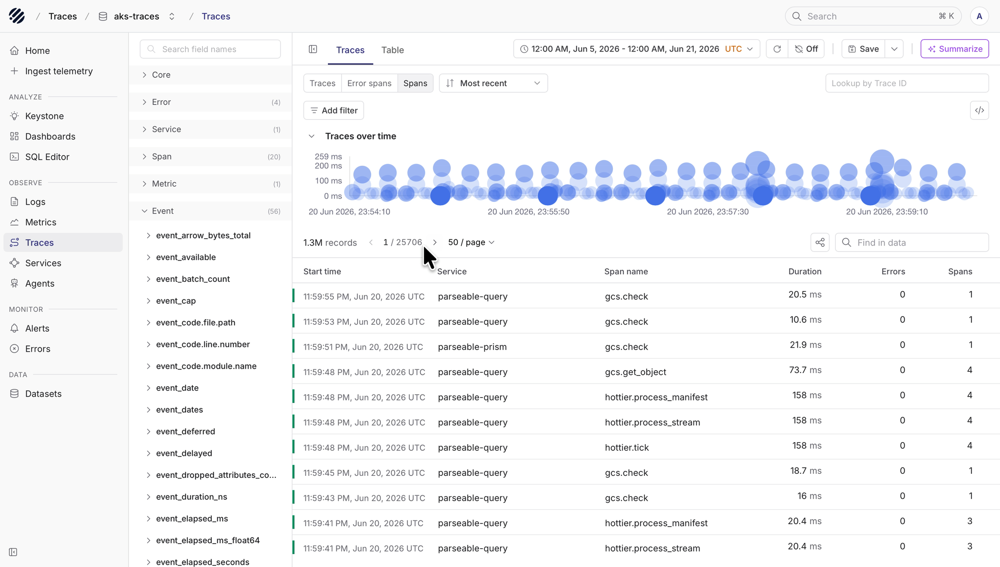
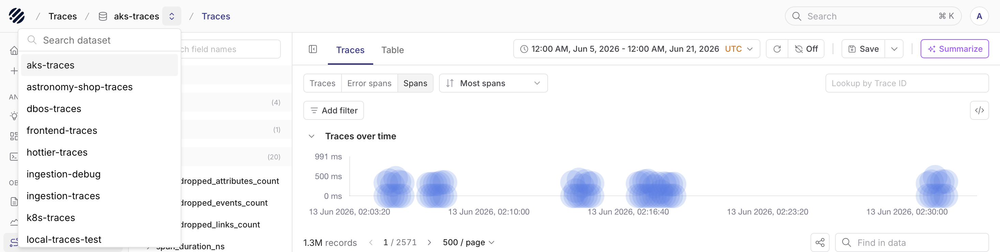
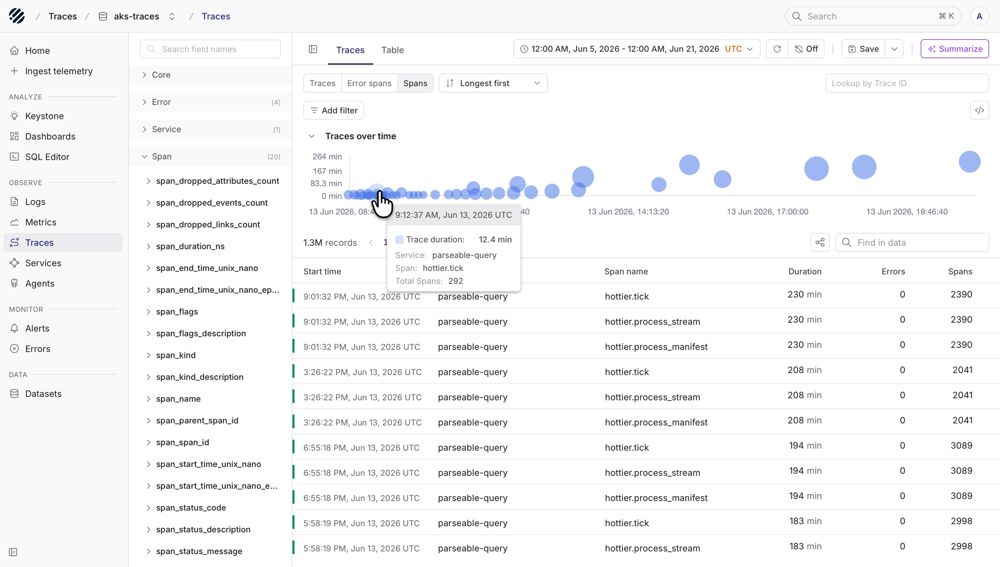
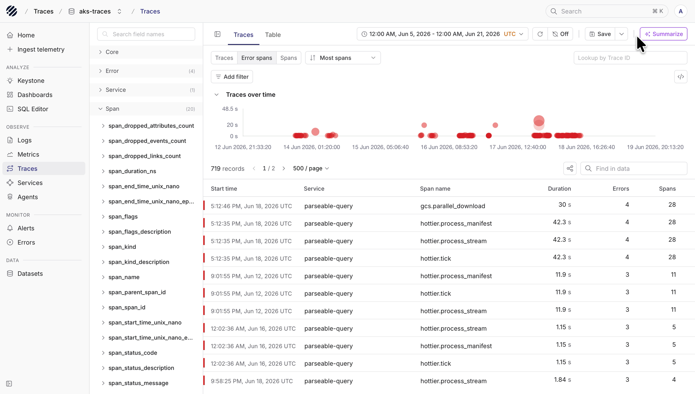
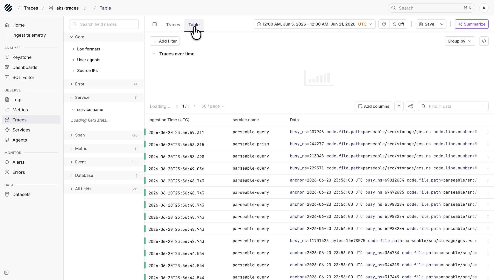
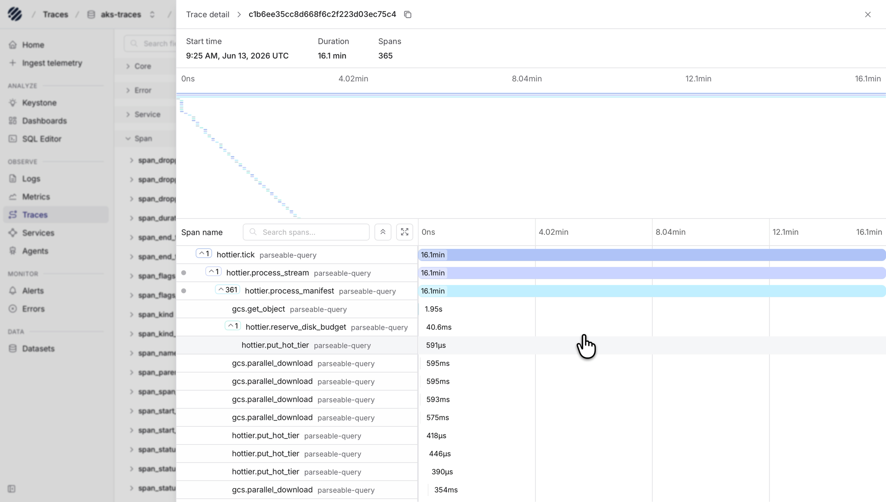
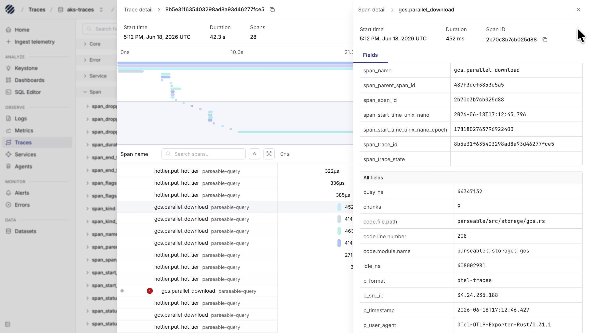

Traces help you understand how a request moved through your system. A log can show what one service wrote. A metric can show that latency changed. A trace shows the path of the request across services and spans, along with where time was spent.

The Traces page in Parseable is built for that flow. You choose a trace dataset, pick the time range, look at trace duration over time, narrow the data with filters, and then open a trace to inspect the waterfall.

## Traces with Parseable

Parseable stores trace data as structured records. That means you can start with a high-level trace view and still move into the fields behind each span when you need detail.

Use this page when you want to answer questions like:

- Which service produced a slow trace
- Which trace has the most spans
- Which traces contain errors
- Which span took the most time inside a trace
- Which service, host, container, or HTTP field is involved
- Which trace id from logs or another tool should be opened directly

## Typical workflow

### Dataset and time range

Start with the dataset selector and the time range picker.

Select the trace dataset from the dataset selector at the top of the page. The page updates around that dataset, including the available fields, chart, trace list, and table columns.

Use the time range picker to decide how much trace data you want to inspect. A smaller time range works well for a known issue. A wider range is useful when you want to compare behavior over time.

You can also choose the timezone from the picker, including your local timezone, so timestamps are easier to read for your team.

The top toolbar also gives you quick access to refresh, auto-refresh, saved views, and summarization. Use auto-refresh when you want to keep watching a live window of traces.

<Callout type="info">
Every trace query is scoped by time. This keeps the query focused on the period you want to inspect and avoids reading more data than needed.
</Callout>

### Traces view

The **Traces** tab is the main place to start. It shows trace duration over time as bubbles and lists the matching traces below the chart.

Each bubble represents a trace. The position shows when it happened and how long it took. Larger bubbles usually point to traces with more spans. Hover over a bubble to see the service, span name, duration, and span count.

The trace list below the chart shows the start time, service, span name, duration, error count, and span count. Click a row when you want to open the full trace detail.

Use the controls above the chart to change what you are looking at:

- **Traces**, for regular trace exploration
- **Error spans**, when you want to focus on traces with errors
- **Spans**, when span count is the main signal
- **Sort**, when you want to move between most recent, longest first, shortest first, most spans, and least spans
- **Lookup by Trace ID**, when you already have a trace id from logs or another system

### Error spans

When you need to debug failures, switch to **Error spans**. The chart and trace list update to show traces that include errors.

Use this view when you want to find traces where something failed and then open the trace detail to see which span reported the error.

### Field groups and filters

The fields panel on the left shows the fields Parseable found in the selected trace dataset. Use it before adding filters or columns. It helps you understand what data is available.

Fields are grouped into sections such as:

- **Core**, for common trace fields
- **Error**, for error-related fields
- **Service**, for service name, namespace, version, and instance id
- **Span**, for span name, span id, parent span id, trace id, duration, and status
- **Metric** and **Event**, when the trace data includes related event fields
- **Database**, **HTTP**, **Container**, **Telemetry**, and other runtime fields when available
- **All fields**, when you want to search across everything

Click **Add filter** when you want to narrow traces to a specific service, span name, status code, trace id, host, or any other field in the dataset.

Active filters appear above the chart. You can remove one filter at a time, or clear all filters when you want to return to the broader view.

After filters are applied, use **Find in data** to search within the visible trace list. This is useful when you want to find a service, span name, id, endpoint, or message fragment inside the current page.

### Table view

Switch to the **Table** tab when you want to inspect spans as raw records instead of trace-level rows.

The Table view is useful when you want to add columns, group by a field, or scan span records directly. For example, you might add `service.name`, `span_name`, `span_duration_ns`, `span_status_code`, `http.response.status_code`, or `span_trace_id`.

Use **Expand rows** from the table toolbar when you want to see more of each span record inline without opening a separate view.

Use **Group by** when you want to compare span records by a field. Use **Find in data** when you want to search within the current table rows.

### Trace detail

Open a trace from the Traces view when you want to understand the request path.

The detail view shows the trace start time, total duration, and span count at the top. Below that, the waterfall shows how spans relate to each other and where time was spent.

Use the waterfall to answer questions like:

- Which span started the trace
- Which child spans ran under it
- Which span took the longest
- Where the trace has many repeated operations
- Whether the time is spent in one service or spread across many spans

You can expand and collapse span groups, search spans by name, and use the minimap at the top to understand the full trace timeline.

### Span detail

Click a span in the waterfall to open the span detail panel.

The span detail panel shows the selected span's start time, duration, span id, fields, and events. Use it when you need the exact attributes behind a span.

The **Fields** tab is useful for service metadata, span ids, trace ids, timing fields, status fields, code fields, HTTP attributes, and resource attributes. These fields help you connect the trace back to logs, services, hosts, containers, and code paths.

The **Events** tab is useful when the span includes event records. This can help explain what happened inside the span, not only how long the span took.

### Saved views, sharing, and summaries

When you have a useful view, save it. Saved views help you come back to the same dataset, filters, fields, and time range without setting everything again.

Use the share control when you want another teammate to open the same view. Use export or SQL when you need to continue the investigation outside the current Traces page.

The **Summarize** button can generate a report for the selected trace data. Use it when you want a quick read of the current traces before looking deeper.

## A simple way to use the page

Most trace investigations follow the same loop:

1. Pick the dataset and time range.
2. Look at trace duration over time.
3. Use filters, error spans, sorting, or Trace ID lookup to narrow the data.
4. Open a trace from the list.
5. Use the waterfall to understand where time was spent.
6. Click spans to inspect fields and events.
7. Save, share, summarize, or move into SQL when needed.
